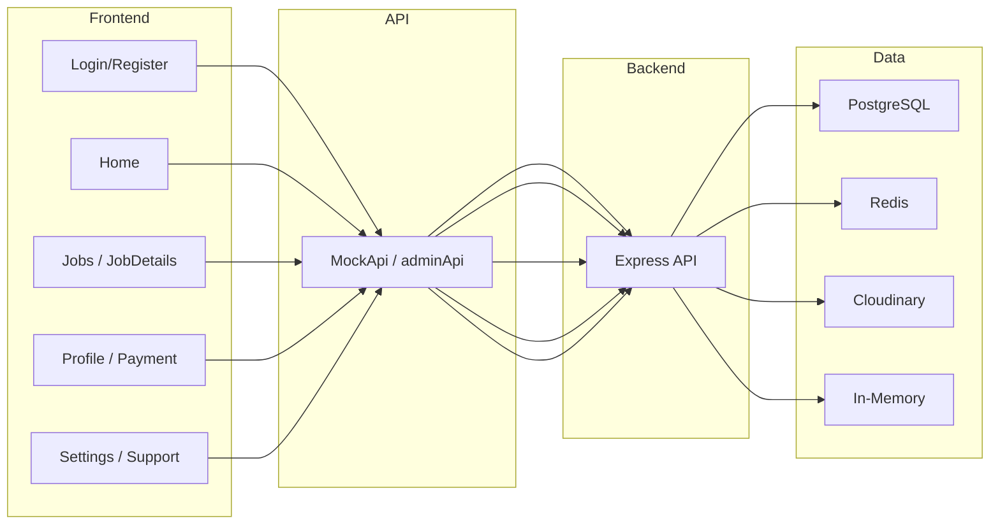
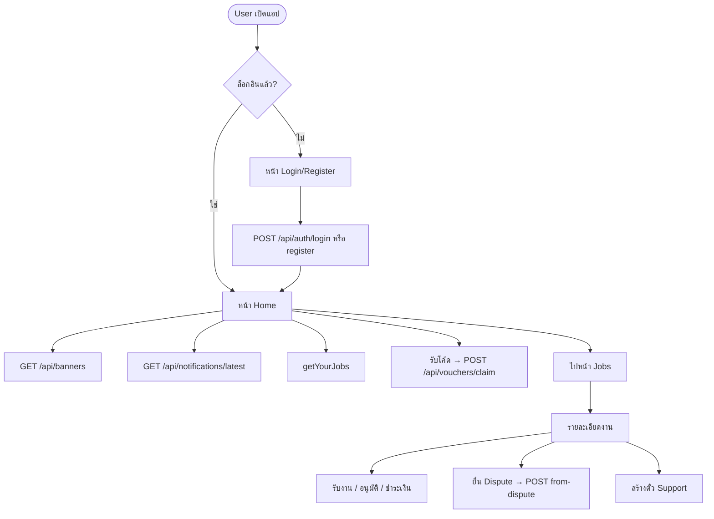
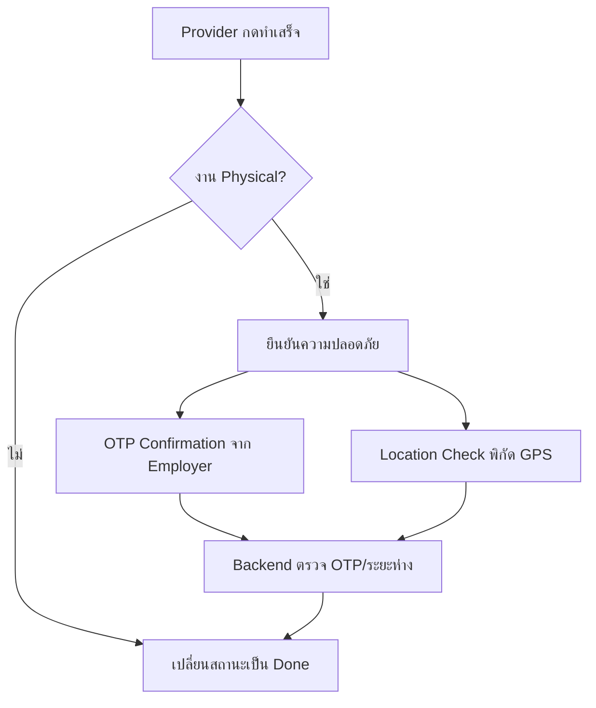

# ลำดับการทำงาน Frontend & Backend (สำหรับทำ Flowchart)

## สรุปภาพรวม

```
[User/Admin] → [Frontend (React/Vite)] → [MockApi / adminApi] → [Backend (Node/Express)] → [PostgreSQL / Redis / Cloudinary / In-Memory]
```

---

## 1. การลงทะเบียนและเข้าสู่ระบบ (Auth)

### Frontend
| ขั้นตอน | หน้า | การเรียก | หมายเหตุ |
|--------|------|----------|----------|
| 1.1 | Login | `MockApi.login(phone, password)` | ล็อกอินด้วยเบอร์/รหัส (แนะนำ: Backend ใช้ **Redis Rate Limiting** ป้องกัน Brute Force) |
| 1.2 | Login | `MockApi.getUserIdByPhone(phone)` แล้ว `getUserById` | โฟน OTP/ลิงก์ (แนะนำ: ใช้ **Redis Rate Limiting** จำกัดการยิง OTP ป้องกันสแปม) |
| 1.3 | Register | `MockApi.register(formData)` | สมัครสมาชิก |
| 1.4 | (หลังล็อกอิน) | เก็บ token / user ใน context + localStorage | - |

### Backend
| Method | Endpoint | คำอธิบาย |
|--------|----------|----------|
| POST | `/api/auth/login` | ล็อกอิน User (phone/password) → คืน JWT + user |
| POST | `/api/auth/register` | สมัครสมาชิกใหม่ |
| POST | `/api/auth/admin-login` | ล็อกอิน Admin → JWT (role ADMIN/AUDITOR) |

---

## 2. หน้าแรก (Home)

### Frontend
| ขั้นตอน | การเรียก | ผลลัพธ์ |
|--------|----------|----------|
| 2.1 | `MockApi.getYourJobs()` | งานของ user → แสดง Active Jobs |
| 2.2 | `MockApi.getLatestAdminNotifications(5)` | ข้อความจากแอดมิน → การ์ดแจ้งเตือน |
| 2.3 | `MockApi.getBanners()` | แบนเนอร์โฆษณา → แคโรเซิลแบนเนอร์ |
| 2.4 | (ถ้ากดรับโค้ด) | `MockApi.claimVoucher(code)` | รับโค้ดส่วนลด → บันทึก voucher ของ user |

### Backend
| Method | Endpoint | คำอธิบาย |
|--------|----------|----------|
| GET | `/api/banners` | แบนเนอร์ที่ active + อยู่ในช่วงวัน (สำหรับ Home) |
| POST | `/api/vouchers/claim` | Body: `code`, `userId` → สร้าง user voucher (วงเงินจำกัด) |
| GET | `/api/vouchers/my` | Query: `userId` → รายการโค้ดที่รับแล้ว ยังใช้ได้ |
| GET | `/api/notifications/latest` | ข้อความ broadcast ล่าสุด (แอดมินส่ง) |

---

## 3. งาน (Jobs) – สร้าง / ค้นหา / รายละเอียด

### Frontend
| ขั้นตอน | หน้า | การเรียก | ผลลัพธ์ |
|--------|------|----------|----------|
| 3.1 | Jobs | `MockApi.getJobs(category, search)` | รายการงานตามหมวด/คำค้น |
| 3.2 | CreateJob | (ส่งฟอร์ม) → Backend หรือ Firestore ตามที่ตั้งค่า | สร้างงาน |
| 3.3 | JobDetails | `MockApi.subscribeToJob(id, cb)` | Real-time อัปเดตสถานะงาน |
| 3.4 | JobDetails | `MockApi.subscribeToMessages(id, cb)` | แชท real-time (แนะนำ: ใช้ In-Memory เก็บ User Presence → แสดงว่าอีกฝ่ายออนไลน์/อ่านแล้ว) |
| 3.5 | JobDetails | `MockApi.acceptJob(id)` | Provider รับงาน |
| 3.6 | JobDetails | **Safety:** OTP Confirmation หรือ Location Check (GPS) → แล้ว `MockApi.markJobAsDone(id, loc)` | Provider ทำเสร็จ (เฉพาะงาน Physical ต้องยืนยันก่อนเปลี่ยนเป็น Done) |
| 3.7 | JobDetails | `MockApi.approveJob(id)` แล้ว `processPayment(...)` | Employer อนุมัติ + ชำระเงิน |
| 3.8 | JobDetails | (ยื่น Dispute) `PaymentService.fileDispute` + `createDisputeSupportTicket` | สร้างตั๋ว Support จาก Dispute |

### Backend
| Method | Endpoint | คำอธิบาย |
|--------|----------|----------|
| GET | `/api/jobs` | รายการงาน (filter category, search) |
| GET | `/api/jobs/:id` | รายละเอียดงาน |
| POST | `/api/jobs` | สร้างงานใหม่ |
| GET | `/api/jobs/recommended` | งานแนะนำ |
| GET | `/api/jobs/all` | งานทั้งหมด (admin/list) |
| POST | `/api/jobs/:id/accept` | Provider รับงาน |
| POST | `/api/jobs/:id/complete` | Provider ทำเสร็จ; **Safety:** รับ OTP หรือพิกัด GPS ก่อนเปลี่ยนสถานะเป็น Done (เฉพาะงาน Physical) |
| GET | `/api/jobs/forms/:category` | ฟอร์มตามหมวด |
| POST | `/api/jobs/categories/:category/calculate-billing` | คำนวณค่าบริการ |

---

## 4. การชำระเงิน (Payment)

### Frontend
| ขั้นตอน | หน้า | การเรียก | ผลลัพธ์ |
|--------|------|----------|----------|
| 4.1 | Payment | `MockApi.getJobDetails(jobId)` | ข้อมูลงาน + ราคา |
| 4.2 | Payment | `MockApi.validateVoucher(code)` | ตรวจโค้ดส่วนลด |
| 4.3 | JobDetails (อนุมัติงาน) | `MockApi.processPayment(jobId, method, discountAmount)` | ชำระเงิน (หักส่วนลดได้) |

### Backend
| Method | Endpoint | คำอธิบาย |
|--------|----------|----------|
| POST | `/api/payments/process` | ชำระเงิน (jobId, method, discountAmount, userId) |
| GET | `/api/payments/status/:jobId` | สถานะการชำระของงาน |
| POST | `/api/payments/release` | ปล่อยเงินให้ Provider |
| GET | `/api/payments/pending` | รายการรอปล่อยเงิน |
| POST | `/api/vouchers/use` | ใช้โค้ดส่วนลด (userId, voucherId, amount) → หัก remainingBaht |

---

## 5. โปรไฟล์ / กระเป๋าเงิน / KYC

### Frontend
| ขั้นตอน | หน้า | การเรียก | ผลลัพธ์ |
|--------|------|----------|----------|
| 5.1 | Profile | `MockApi.getProfile()` | ข้อมูล user |
| 5.2 | Profile | `MockApi.getTransactions()` | ประวัติธุรกรรม |
| 5.3 | Profile/Settings | `MockApi.updateProfile(payload)` | แก้ไขโปรไฟล์ |
| 5.4 | Profile | `MockApi.walletTopUp(amount)` | เติมเงิน |
| 5.5 | Profile | `MockApi.walletWithdraw(amount)` | ถอนเงิน |
| 5.6 | Profile/KYC | `MockApi.submitEnhancedKYC(data)` | ส่ง KYC; **ควรมี Flow Re-Verify** ทุก 1 ปี หรือเมื่อเปลี่ยนข้อมูลสำคัญ (เช่น บัญชีธนาคาร) |
| 5.7 | Settings | `MockApi.addBankAccount` / `removeBankAccount` | บัญชีธนาคาร (การเปลี่ยนอาจ trigger KYC Re-Verify) |

### Backend
| Method | Endpoint | คำอธิบาย |
|--------|----------|----------|
| GET | `/api/users/profile/:id` | โปรไฟล์ user |
| PATCH | `/api/users/profile/:id` | อัปเดตโปรไฟล์ |
| GET | `/api/wallet/:userId/summary` | สรุปกระเป๋าเงิน |
| GET | `/api/users/transactions/:userId` | ประวัติธุรกรรม |
| POST | `/api/kyc/submit` | ส่ง KYC (รูป + ข้อมูล) |
| GET | `/api/kyc/status/:userId` | สถานะ KYC |
| POST | `/api/kyc/re-verify` | Re-Verify KYC (ทุก 1 ปี หรือเมื่อเปลี่ยนข้อมูลสำคัญ เช่น บัญชีธนาคาร) |

---

## 5.x จุดยืนยันความปลอดภัย (Safety Flow)

| จุด | Flow | หมายเหตุ |
|-----|------|----------|
| **3.6 Mark Job as Done** | สำหรับงาน **Physical** (เช่น ช่างไฟมาบ้าน): ก่อนเปลี่ยนสถานะเป็น Done ให้มี **OTP Confirmation** (Employer ได้ OTP ยืนยัน) หรือ **Location Check** (พิกัด GPS จากอุปกรณ์/หมวกกันน็อก) เพื่อป้องกันการโกงว่ามาทำงานแล้วแต่จริงๆ ไม่ได้มา | Backend ตรวจ OTP หรือระยะห่างจากจุดงานก่อนอัปเดตสถานะ |
| **5.6 KYC** | ควรมี Flow **Re-Verify**: (1) ทุก **1 ปี** อัตโนมัติ หรือ (2) เมื่อมีการ**เปลี่ยนข้อมูลสำคัญ** (เช่น บัญชีธนาคาร) → ใช้ฟิลด์เช่น `kyc_verified_at` / `kyc_next_reverify_at` | ป้องกัน KYC ผ่านครั้งเดียวแล้วไม่ตรวจอีก |

---

## 5.y ข้อเสนอเชิงเทคนิค (Redis / In-Memory)

| ใช้กับ | วัตถุประสงค์ | หมายเหตุ |
|--------|----------------|----------|
| **Redis** | **Rate Limiting** ในหน้า Login (1.1) และการส่ง OTP | ป้องกัน Brute Force / การยิง API ถล่ม (เช่น `express-rate-limit` + Redis store) |
| **In-Memory** (หรือ Redis) | เก็บ **User Presence** (ใครออนไลน์อยู่บ้าง) | มีประโยชน์สำหรับแชท Real-time (3.4): แสดงว่าอีกฝ่ายออนไลน์ / อ่านแล้ว |

---

## 6. Help & Support และ Dispute

### Frontend (User)
| ขั้นตอน | หน้า | การเรียก | ผลลัพธ์ |
|--------|------|----------|----------|
| 6.1 | Settings (Help) | `MockApi.getMySupportTickets(userId)` | ตั๋วที่เปิดอยู่ |
| 6.2 | Settings | `MockApi.getSupportTicketMessages(ticketId)` | ข้อความในตั๋ว |
| 6.3 | Settings | `MockApi.createSupportTicket({...})` | สร้างตั๋วใหม่ (ข้อความแรก) |
| 6.4 | Settings | `MockApi.sendSupportMessage(ticketId, message)` | ส่งข้อความเพิ่ม |
| 6.5 | JobDetails (Dispute) | `PaymentService.fileDispute` + `MockApi.createDisputeSupportTicket(jobId, userId, reason)` | ยื่น Dispute + สร้างตั๋ว Support |

### Backend (Public/User)
| Method | Endpoint | คำอธิบาย |
|--------|----------|----------|
| POST | `/api/support/tickets` | สร้างตั๋ว (Help & Support) |
| POST | `/api/support/tickets/from-dispute` | สร้างตั๋วจาก Dispute |
| GET | `/api/support/tickets` | รายการตั๋ว (query: userId) |
| GET | `/api/support/tickets/:id/messages` | ข้อความในตั๋ว |
| POST | `/api/support/tickets/:id/messages` | User ส่งข้อความ (Backend ตอบ BOT อัตโนมัติถ้าคำตรง) |

---

## 7. แอดมิน (Nexus Admin)

### Frontend (Nexus Admin)
| ฟีเจอร์ | การเรียก | ใช้เมื่อ |
|---------|----------|----------|
| ล็อกอิน | `adminLogin(email, password)` | หน้า Admin Login |
| ผู้ใช้ | `getAdminUsers`, `getAdminUser(id)` | User Management |
| บทบาท/แบน | `updateAdminUserRole`, `banAdminUser`, `suspendAdminUser` ฯลฯ | จัดการ user |
| การเงิน | `getFinancialAudit`, `getJobGuarantees`, `getCommission` ฯลฯ | หน้า Financial |
| แจ้งเตือน | `sendBroadcastNotification`, `getAdminNotifications` | Push Notification |
| สถานะ API | `getGatewayStatus()` | API Gateway View |
| Support | `getSupportTickets`, `getSupportTicketMessages`, `replySupportTicket`, `resolveSupportTicket`, `getSupportAiSuggestion` | Support Ticket View |
| แบนเนอร์ | `getBanners`, `createBanner`, `updateBanner`, `deleteBanner` | Content Manager |
| Audit | (เรียก audit logs API) | Audit Logs View |

### Backend (Admin – ต้องส่ง JWT)
| กลุ่ม | Endpoint ตัวอย่าง | คำอธิบาย |
|------|-------------------|----------|
| Users | GET/PATCH `/api/admin/users`, `/api/admin/users/:id`, suspend/ban/reactivate | จัดการ user |
| Financial | GET `/api/admin/financial/audit`, job-guarantees, commission, expenses, market-cap | ข้อมูลการเงิน |
| Notifications | POST `/api/admin/notifications/broadcast`, GET `/api/admin/notifications` | ส่ง broadcast |
| Gateway | GET `/api/admin/gateway-status` | สถานะ services + endpoints |
| Support | GET `/api/admin/support/tickets`, GET/POST messages, PATCH status, POST ai-suggest | ตั๋วสนับสนุน |
| Banners | GET/POST `/api/admin/banners`, PATCH/DELETE `/api/admin/banners/:id` | จัดการแบนเนอร์ |
| Audit | GET `/api/audit/logs` | Audit logs |

---

## 8. อัปโหลดไฟล์ / สื่อ

### Frontend
- `MockApi.uploadImage(file)` หรือส่ง base64 ไป Backend
- KYC: อัปโหลดรูปบัตร
- แชท: อัปโหลดรูปแนบ

### Backend
| Method | Endpoint | คำอธิบาย |
|--------|----------|----------|
| POST | `/api/upload` | อัปโหลดไฟล์ทั่วไป (base64) → Cloudinary |
| POST | `/api/upload/image` | อัปโหลดรูป (optimize) |
| POST | `/api/upload/video` | อัปโหลดวิดีโอ |
| POST | `/api/upload/form` | multipart form |
| GET | `/api/cloudinary/files` | รายการไฟล์ |
| DELETE | `/api/cloudinary/files/:public_id` | ลบไฟล์ |

---

## 9. ลำดับการทำงานแบบ Flow (สรุปสำหรับ Flowchart)

### 9.1 User ใช้แอป (แบบย่อ)
```
Login/Register → Home (โหลดงาน, แบนเนอร์, แจ้งเตือน, รับโค้ดได้)
    → Jobs / CreateJob → JobDetails (รับงาน/แชท/อนุมัติ/ชำระเงิน/Dispute)
    → Profile (โปรไฟล์, กระเป๋า, KYC, ธนาคาร)
    → Settings (โปรไฟล์, Help & Support แชท)
    → Payment (ชำระเงิน + ใช้โค้ดส่วนลด)
```

### 9.2 Admin ใช้ Nexus Admin (แบบย่อ)
```
Admin Login (JWT) → Dashboard
    → User Management (รายชื่อ, แก้ role, แบน, ระงับ)
    → Financial (audit, commission, job guarantees)
    → Push Notification (ส่ง broadcast → ไปที่ Home ของ user)
    → API Gateway (ดูสถานะ backend, endpoints, downtime)
    → Support Tickets (ดูตั๋วจาก Home + Dispute, ตอบแชท, AI แนะนำคำตอบ, ปิดตั๋ว)
    → Content Manager (แบนเนอร์ + โค้ดส่วนลด → ไปที่ Home)
    → Audit Logs (ดูประวัติการเปลี่ยนแปลง)
```

### 9.3 Backend รับคำขอ (แบบกลุ่ม)
```
Public:  /api/health, /api/banners, /api/vouchers/claim, /api/vouchers/my,
         /api/notifications/latest, /api/support/tickets (สร้าง/ข้อความ),
         /api/auth/login, /api/auth/register

User (JWT/หรือไม่มีแล้วแต่ endpoint):
         /api/jobs/*, /api/users/*, /api/payments/*, /api/kyc/*,
         /api/upload/*, /api/reports/*, /api/providers, /api/wallet/*

Admin (JWT Admin):  /api/admin/*, /api/audit/logs
```

---

## 10. ตัวอย่าง Mermaid Flowchart (สั้น)





### 9.4 Safety Flow – Mark Job as Done (งาน Physical)



### 9.5 Technical: Redis & In-Memory

- **Redis:** Rate limit หน้า Login (1.1) + การส่ง OTP → ป้องกัน Brute Force
- **In-Memory (หรือ Redis):** User Presence สำหรับแชท (3.4) → ออนไลน์ / อ่านแล้ว

---

ไฟล์นี้ใช้เป็นฐานสำหรับวาด Flowchart ใน draw.io / Mermaid / Figma ฯลฯ ได้ โดยอาจแตกแต่ละหมวด (Auth, Jobs, Payment, Support, Admin) เป็น diagram แยกตามต้องการ
