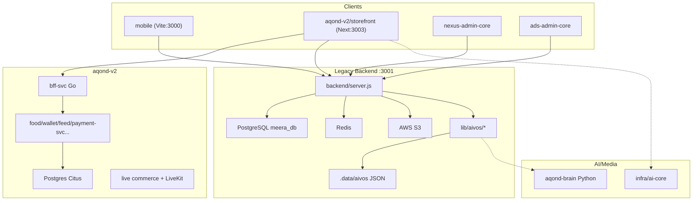

# AQOND/meerak Monorepo — Documentation Facts

Repository root: `g:\meerak`  
Root npm package name: **aqond** (`g:\meerak\package.json`)  
Git remote referenced: `https://github.com/khemmatrat/meerak-backend.git`

---

## 1. Top-Level Directory Structure

| Path | Role |
|------|------|
| `g:\meerak\backend` | Primary Node/Express API (~37k-line `server.js`), `lib/`, `routes/`, `db/migrations/` (255 SQL files) |
| `g:\meerak\mobile` | Core product shell — Vite + React + Capacitor Android (`npm run dev` → port **3000**) |
| `g:\meerak\aqond-v2` | V2 commerce/marketplace platform — Next.js storefront, Go microservices, infra, live commerce |
| `g:\meerak\aqond-brain` | Python media/AI factory (reels, hooks, Grok, Stable Diffusion, Discord dashboards) |
| `g:\meerak\nexus-admin-core` | Main admin UI (Vite + React 19) — KYC, courses, ads, content |
| `g:\meerak\ads-admin-core` | Dedicated ads admin UI (Vite + React 19) |
| `g:\meerak\landing-aqond` | Marketing landing site (Vite, port **3009**) |
| `g:\meerak\helper-docs` | User-facing docs (Docusaurus 3) |
| `g:\meerak\support` | Isolated AI support microservice (`support/src/index.js`, own Postgres migrations) |
| `g:\meerak\scripts` | Deploy, phase-spec generation, golive scripts |
| `g:\meerak\dev-test-accounts` | Test account setup scripts |
| `g:\meerak\server.js` | Root entry — re-exports `backend/server.js` for Render/`npm start` |

**`aqond-v2` sub-structure:**
- `apps/storefront` — Next.js 14 app (`@aqond/storefront`, dev port **3003** per cursor rules)
- `services/` — Go microservices (`bff-svc`, `food-svc`, `wallet-svc`, `feed-svc`, `payment-svc`, `merchant-ops-svc`, `cart-svc`, `dispatch-svc`, `order-svc`, etc.)
- `live/` — `commerce-service`, `token-service` (LiveKit)
- `marketplace/` — `bagisto-bridge`, `escrow-service`, `sync-service`
- `infra/` — Postgres migrations, Docker/Helm/Kong, `ai-core`, dev scripts
- `analytics/`, `chat/`, `cms/`, `notifications/` — standalone Node services each with `server.js`
- `packages/ui` — shared UI package for storefront

---

## 2. Major Products / Modules

### Mobile (`g:\meerak\mobile`)
- Core shell: Welcome, Login (OTP), Register, Home, job board, bookings, wallet, video feed
- Course marketplace UI: `CourseDetailMarketplace.tsx`, `CourseMarketplace.tsx`, admin course pages
- Capacitor Android build; connects to backend API and opens v2 storefront via WebView/handoff

### Storefront v2 (`g:\meerak\aqond-v2\apps\storefront`)
- Next.js 14 App Router under `/m/*` (home, account, merchant, product)
- Merchant routes: shops, menu, ad-studio
- BFF catch-all: `app/api/bff/[...path]/route.ts` — proxies to Go services + local food/cart handlers
- Local server modules: `localCatalog.ts`, `localFood.ts`, `localFoodCart.ts`, `shopChatStore.ts`, `merchantAdPublish.ts`

### Merchant
- **v2**: `merchant-ops-svc` (Go), storefront `/m/merchant/*`, merchant ad video APIs
- **Legacy backend**: `/api/merchants/top10`, merchant onboarding via KYC/provider flows
- **AIVOS merchant-ad**: `backend/lib/aivos/merchant-ad/` — ad video generation pipeline

### Food
- **v2 Go**: `aqond-v2/services/food-svc/` + Postgres migration `025_food_svc.sql`
- **Storefront BFF**: `v1/food/nearby`, `v1/food/menu`, `v1/food/cart/*` in BFF route
- **AIVOS**: workflow template `wf-food-delivery`, skill `ai-food` (tests in `aivosPhase16.test.js`)

### Wallet
- **Legacy backend** (`server.js`): `/api/wallet/*` — summary, deposit (PaySo), topup, transactions, receipts, tax documents, certified statements
- **v2 Go**: `wallet-svc`, `coins-svc`; migration `034_merchant_wallet_fees.sql`
- Ledger tables: `payment_ledger_audit`, wallet deposit webhook logs (migrations 158, 195, etc.)

### Admin
- **`nexus-admin-core`**: KYC review, course marketplace admin (`CourseMarketplaceAdminView.tsx`), ads summary, content manager
- **`ads-admin-core`**: ads campaign/billing/fraud admin
- **Backend admin API**: `/api/admin/*` (KYC, payments, internal-gateway, courses, cron, PDPA export, etc.)

### AI / AIVOS
- **`backend/lib/aivos/`** — full AI video/ops platform mounted on main backend
- Submodules: runtime, marketplace, billing, governance, QA, skills, orchestrator, knowledge, workflows, applications, tenants, integration, growth, merchant-ad
- Feature flags via env: `AIVOS_RUNTIME_ENABLED`, `AIVOS_MARKETPLACE_ENABLED`, etc.
- **`aqond-brain`**: offline Python media factory (not wired as HTTP service in main backend)
- **`aqond-v2/infra/ai-core`**: Node AI prompt service for storefront/live commerce

### Other notable backend domains
- **Job board / bookings**: `/api/jobs`, `/api/bookings`, `/api/bids`
- **Advance jobs** (procurement/quotation): `/api/advance-jobs/*`
- **Course marketplace**: `/api/courses/*`, `/api/course-studio/*`, `/api/course-marketplace/*`
- **Video feed / stories**: `/api/videos/*`, `/api/stories/*`
- **Marine charter**: `/api/marine/*`
- **Insurance**: `/api/insurance/*`
- **Growth engine**: `/api/growth/*`
- **Compass onboarding**: `/api/onboarding/compass-*`
- **Training LMS**: `routes/trainingLms.js`

---

## 3. Backend Entry Points

| Entry | Path | Notes |
|-------|------|-------|
| **Production main** | `g:\meerak\backend\server.js` | `npm run start` → `node --max-old-space-size=4096 server.js`; default port **3001** |
| **Root delegate** | `g:\meerak\server.js` | `import './backend/server.js'` for Render |
| **TypeScript alt** | `g:\meerak\backend\src\index.ts` | `npm run dev` in backend package (`tsx watch`); slimmer Express skeleton, not the full monolith |
| **Socket.IO** | Created in `backend/server.js` via `http.createServer` + `socket.io` | Real-time alongside Express |

**Other service entry points:**
- `aqond-v2/live/commerce-service/server.js`
- `aqond-v2/live/token-service/server.js` (LiveKit tokens)
- `aqond-v2/infra/ai-core/server.js`
- `aqond-v2/analytics|chat|cms|notifications/server.js`
- `aqond-v2/marketplace/{bagisto-bridge,escrow-service,sync-service}/server.js`
- `support/src/index.js`
- Go services: each `aqond-v2/services/*-svc/main.go`

**Route registration in main backend** (extracted modules):
- `registerAivosRoutes`, `registerWorkspaceRoutes`
- `registerCourseMarketplaceRoutes`, `registerCourseStudioRoutes`, `registerCoursePurchaseRoutes`
- `registerTrainingLmsRoutes`, `registerSecurityPulseRoutes`
- `registerWalletLiquidityAdminRoutes`, `registerUserFinancialMovementsAdminRoutes`, etc.
- `attachAdsAdminRoutes`, `registerAntiBypassAdminRoutes`
- `mountSignupIntentRoutes`, `registerRescueNetTelecomRoutes`, `registerGigastoreWebhookRoutes`

---

## 4. Key API Route Prefixes (Legacy Backend)

Top prefixes on `backend/server.js` and `backend/lib/*`:

| Prefix | Domain |
|--------|--------|
| `/api/auth` | Login, register, admin-login, TOTP, password reset |
| `/api/admin` | KYC, payments, internal-gateway, courses, cron, reports |
| `/api/ads-admin` | Ads campaigns, billing, fraud, outcomes, optimization |
| `/api/aivos` | AI runtime, apps, skills, workflows, growth, merchant-ad, billing, governance |
| `/api/wallet` | Deposits, topup, transactions, receipts, tax docs |
| `/api/payments`, `/api/payment-gateway` | Stripe/PaySo intents, holds, releases, card tokenization |
| `/api/webhooks` | checkout, stripe, payso |
| `/api/jobs`, `/api/advance-jobs` | Job board + advanced procurement |
| `/api/bookings`, `/api/bids` | Booking flow, bidding |
| `/api/courses`, `/api/course-studio`, `/api/course-marketplace` | LMS / marketplace |
| `/api/videos`, `/api/stories` | Feed, uploads, engagement |
| `/api/kyc`, `/api/provider-onboarding`, `/api/onboarding` | Identity + compass |
| `/api/users`, `/api/providers` | Profiles, availability |
| `/api/growth` | Referrals, incubation, subscription plans |
| `/api/marine` | Charter/marine bookings |
| `/api/insurance` | Claims |
| `/api/upload`, `/api/storage` | S3/Cloudinary uploads |
| `/api/merchants` | Top-10 merchants |
| `/health`, `/api/health` | Health checks |

**v2 storefront BFF** (Next.js): `/api/bff/v1/*`, `/api/merchant/*`, `/api/shop-chat/*`

---

## 5. Database / Storage Patterns

### PostgreSQL (primary)
- **`pg` Pool** in `backend/server.js`; default DB `meera_db`, user `meera` (from phase check scripts)
- **255 numbered migrations** in `backend/db/migrations/` (latest seen: `260_ai_runtime_semantic.sql`)
- Separate Postgres for **aqond-v2** via `aqond-v2/infra/postgres/migrations/` (Citus-oriented, 37+ migrations)
- **support** service: own `support/db/migrations/001_support_core.sql`
- Docker container name referenced: `aqond-postgres`

### Redis
- `createClient` from `redis` in `backend/server.js`
- Used for rate-limit unlock, support sessions (`SUPPORT_SESSION_KEY`), dispatch pub/sub in v2

### Object storage
- **AWS S3** via `backend/lib/s3-client.js` (`uploadToS3`, `listS3Files`, health checks)
- Storefront also uses `@aws-sdk/client-s3`

### JSON file storage (`.data`)
- `backend/.data/aivos/merchant-ad/` — `jobs.json`, `token-wallets.json`, rendered output under `output/`
- Written by `merchantAdStorage.js`, `tokenEngine.js` (`path.join(process.cwd(), '.data', 'aivos', 'merchant-ad')`)

### In-memory / hybrid
- Support tickets/messages stored in-memory arrays in `server.js` (`supportTicketsStore`, capped at 500)
- Some AIVOS tenant session data in runtime memory (phase 18 tests)

### Other
- **Firebase** — auth in mobile/storefront; `firebase-admin` in backend
- **landing-aqond** uses `better-sqlite3` locally
- **ClickHouse** referenced in ads verification scripts (`verify-ads-clickhouse.js`)

---

## 6. Shared Services

### Payment
- `backend/lib/paymentManager.js` — PaySo/Ksher/Stripe provider config
- `backend/lib/paymentHttpClient.js` — `PaymentHttpClient`
- Routes: `/api/payments/*`, `/api/payment-gateway/*`, webhooks
- v2: `aqond-v2/services/payment-svc/` (PaySo webhook handler)
- Business action handlers in `backend/lib/paymentBusinessActions/`

### Wallet
- Legacy: extensive `/api/wallet/*` in `server.js`
- v2: `wallet-svc`, `coins-svc`, `merchant-ops-svc/wallet_fees.go`
- Ledger: `payment_ledger_audit`, hybrid deposit (migration 158)

### Token (card tokenization + live tokens)
- Card: `POST /api/payments/card-token` via PaySo TEP
- Live commerce: `aqond-v2/live/token-service` with **LiveKit** (`livekit-server-sdk`)
- AIVOS merchant-ad token wallets in `.data/aivos/merchant-ad/token-wallets.json`

### Feed
- Legacy: `GET /api/videos/feed` in `server.js`; engagement via `videoEngagement.js`
- v2: `feed-svc` (Go, `fanout.go`), `video-svc`, `recsys-svc`
- Infra scripts: `seed-feed-local.ps1`, `dev-up-feed.ps1`

---

## 7. Phase 16–19 Reports / Artifacts

**No standalone PHASE16–19 markdown reports** were found. Phase work is captured as:

### Course Marketplace phases (16–19)

| Phase | Focus | Artifacts |
|-------|-------|-----------|
| **16** | Buyer conversion & trust (purchase sheet, top-up UX, recommendations) | `run-course-phase16-check.js`, `coursePhase16.test.js`, `coursePhase16.e2e.test.js` |
| **17** | Refunds, payouts, tax docs, platform revenue | Migration `237_course_marketplace_phase17.sql`, libs: `courseRefundEngine.js`, `coursePayoutService.js`, `courseFiscalService.js`; `run-course-phase17-check.js` |
| **18** | Admin ops, funnel analytics, launch checklist | Migration `238_course_marketplace_phase18.sql` (`course_funnel_events`, `course_marketplace_audit_log`); `courseLaunchChecklist.js`, `courseFunnelAnalytics.js`; `run-course-phase18-check.js` |
| **19** | Payment regression (job/booking/wallet unchanged) | `run-course-phase19-check.js`, `coursePaymentRegression.js`, `coursePhase19.test.js` |

### AIVOS phases (16–19) — separate numbering

| Phase | Title (from test file headers) |
|-------|-------------------------------|
| **16** | Business Workflow Template Engine |
| **17** | AI Business Application Framework |
| **18** | Multi-Tenant SaaS Platform |
| **19** | Enterprise Integration & API Gateway |

Tests: `backend/__tests__/aivosPhase16.test.js` through `aivosPhase19.test.js`

### Other phase artifacts at root
- `phase6_regression_output.txt`, `phase6_course_regression.txt`, `phase6_aivos_regression.txt`
- Scripts for phase 20: `gen_phase20_*.py`, `append_phase20_*.py`
- `coursePhase20.test.js`, `aivosPhase20Growth.test.js` exist (beyond requested range)

---

## 8. Tech Stack

| Layer | Technologies |
|-------|-------------|
| **Mobile** | React 19, Vite 6, Capacitor 8, TypeScript, Tailwind 4, Stripe.js, Firebase, Socket.IO client |
| **Storefront v2** | Next.js 14.2, React 18, TypeScript, Firebase, HLS.js, AWS S3 |
| **Legacy admin UIs** | Vite 6, React 19, Recharts, Lucide, Vitest (nexus-admin) |
| **Main backend** | Node ≥18, Express 4, ES modules, `pg`, Redis, Socket.IO, Bull, Stripe, Firebase Admin, AWS SDK (S3/Rekognition), Winston, Helmet, Multer, Sharp, FFmpeg |
| **Backend alt** | TypeScript in `backend/src/` (partial; production uses `server.js`) |
| **v2 microservices** | Go 1.x (`pgx/v5`, Citus), Docker, Kong (Helm), Redis pub/sub |
| **AI / media** | Python (`aqond-brain`), Google Generative AI, `@google/genai` in frontends |
| **Live commerce** | LiveKit, Node commerce/token services |
| **Marketplace bridge** | Bagisto (PHP), escrow/sync Node services |
| **Docs** | Docusaurus 3 |
| **Support service** | Express 4, Postgres, JWT |
| **Testing** | Node test runner, Jest (integration), Supertest |
| **Deploy** | Docker, Helm (`aqond-v2/infra/helm`), PowerShell deploy scripts, Render entry via root `server.js` |

---

## Architecture Snapshot

---

**Key boundary rule (from codebase):** `mobile` is the core product shell on port 3000; partner/marketplace/v2 identity work lives in `aqond-v2/apps/storefront` without modifying mobile unless explicitly requested.