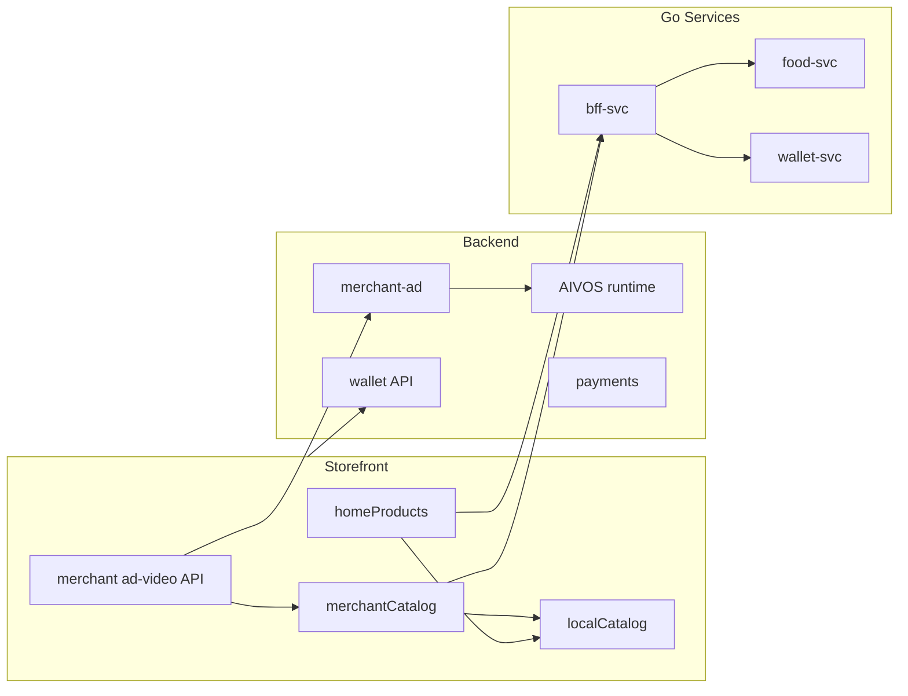

# AQOND — Dependency Graph

**Last Updated:** 2026-06-29

---

## Module Relationships

---

## Shared Services Dependencies

| Consumer | Shared Service | Coupling |
|----------|----------------|----------|
| merchant-ad | AIVOS runtime | Hard |
| merchant-ad | XAI Grok API | Optional (fallback kenburns) |
| storefront checkout | payment-svc / backend payments | Hard |
| mobile wallet | backend `/api/wallet` | Hard |
| storefront home | bff-svc OR localCatalog | Soft (dev fallback) |
| ads-admin | ads ledger tables | Hard |
| live commerce | token-service LiveKit | Hard |

---

## External Dependencies

| Package / Service | Used By |
|-------------------|---------|
| PostgreSQL | backend, v2 services, support |
| Redis | backend rate limit, dispatch |
| AWS S3 | backend uploads, storefront media |
| Firebase Auth | mobile, storefront |
| PaySo / Stripe | payments |
| XAI API | merchant-ad Grok |
| LiveKit | live commerce |
| ffmpeg | merchant-ad video concat |

---

## Circular Dependency Detection

| Check | Result |
|-------|--------|
| AIVOS ↔ merchant-ad | OK — merchant-ad is submodule |
| storefront ↔ backend | OK — HTTP only, no import cycle |
| localCatalog ↔ affiliate | **Was circular overwrite** — fixed DOS-002 |
| payment ↔ wallet | Soft — shared ledger, no code cycle |

**Critical path (merchant-ad sprint):**  
`MerchantAdStudioClient` → `merchantAdProxy` → `backend merchant-ad` → `videoEngine` → `grokVideoBridge` → publish → `merchantCatalog` → `homeProducts`

---

## Critical Paths

1. **Checkout:** cart → checkout/place → payment-svc → order-svc
2. **Wallet deposit:** wallet/deposit → PaySo webhook → ledger audit
3. **Merchant ad publish:** generate → publish → catalog → home BFF
4. **Food order:** food cart → checkout → dispatch-svc → rider jobs
