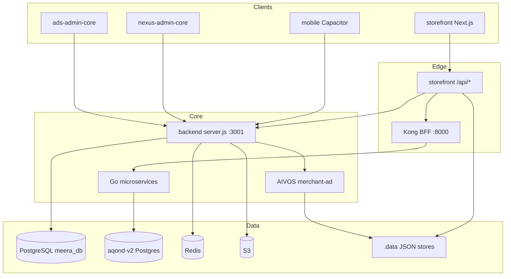
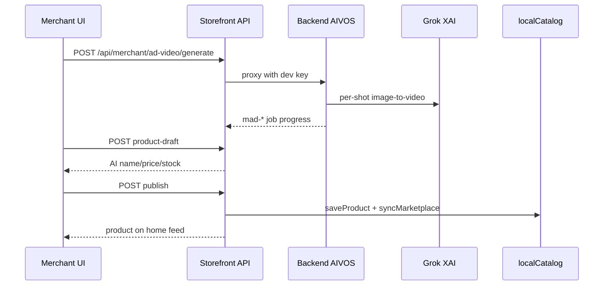

# AQOND — Master Blueprint

**Last Updated:** 2026-06-29

Complete platform architecture reference for AQOND/meerak monorepo.

---

## Products

| Product | Path | Description |
|---------|------|-------------|
| Mobile Core | `mobile/` | Vite + React + Capacitor — jobs, wallet, feed, course marketplace |
| Storefront v2 | `aqond-v2/apps/storefront/` | Next.js 14 — marketplace, food, merchant ops, live commerce |
| Legacy Backend | `backend/` | Express monolith — auth, wallet, payments, courses, AIVOS |
| Nexus Admin | `nexus-admin-core/` | KYC, courses, content, ads summary |
| Ads Admin | `ads-admin-core/` | Campaign billing, fraud, optimization |
| AQOND Brain | `aqond-brain/` | Offline Python media/AI factory |
| Landing | `landing-aqond/` | Marketing site |
| Support MS | `support/` | Isolated support microservice |

---

## Modules (High Level)

### Backend Domains
- Auth / KYC / Onboarding (Compass)
- Job board + Advance jobs (procurement)
- Bookings / Bids
- Course marketplace + Studio + LMS
- Wallet + Payments (PaySo, Stripe)
- Video feed + Stories
- Growth engine + Subscriptions
- Ads platform (campaigns, ledger, outcomes)
- AIVOS (AI runtime, skills, workflows, merchant-ad)
- Marine, Insurance, PRB modules

### Storefront v2 Domains
- Home / Search / Product PDP
- Cart / Checkout / Orders
- Merchant back-office (shops, menu, ad-studio, wallet)
- Food nearby / cart / tracking
- Rider dispatch
- Live commerce + Studio playback
- Shop chat, notifications, AI Jarvis

### Go Microservices (`aqond-v2/services/`)
`bff-svc`, `food-svc`, `wallet-svc`, `feed-svc`, `payment-svc`, `merchant-ops-svc`, `cart-svc`, `dispatch-svc`, `order-svc`, `catalog-svc`, `coins-svc`

---

## Shared Services

### Payment
- `backend/lib/paymentManager.js`, `paymentHttpClient.js`
- Routes: `/api/payments/*`, `/api/payment-gateway/*`, webhooks
- v2: `payment-svc` (PaySo)

### Wallet
- Legacy: `/api/wallet/*` in `server.js`
- v2: `wallet-svc`, `coins-svc`
- Ledger: `payment_ledger_audit`, hybrid deposit (migration 158)

### Token
- Card tokenization: PaySo TEP via `/api/payments/card-token`
- LiveKit tokens: `aqond-v2/live/token-service`
- AIVOS merchant-ad clip tokens: `.data/aivos/merchant-ad/token-wallets.json`

### AI
- **AIVOS** (`backend/lib/aivos/`): runtime, marketplace, billing, governance, skills, workflows, merchant-ad
- **ai-core** (`aqond-v2/infra/ai-core`): storefront prompts
- **aqond-brain**: offline reels/hooks/Grok pipelines

### Feed
- Legacy: `/api/videos/feed`
- v2: `feed-svc`
- Storefront: `/api/feed/social`

---

## Integration Relationships

---

## Merchant Ad Video (Current Sprint Architecture)

---

## Future Products

- Unified catalog-svc write path (replace local `.data` in production)
- Full merchant-ad token economics in Postgres
- Cross-product affiliate + growth engine integration
- aqond-brain online serving via AIVOS skills
- Multi-region Citus scaling (aqond-v2 infra)

---

## Entry Points

| Service | Command | Port |
|---------|---------|------|
| Backend | `cd backend && node server.js` | 3001 |
| Storefront | `cd aqond-v2/apps/storefront && npm run dev` | 3003 |
| Mobile | `cd mobile && npm run dev` | 3000 |
| Kong | `aqond-v2/infra` docker compose | 8000 |

See [MODULE_MAP.md](./MODULE_MAP.md) for per-module routes.
