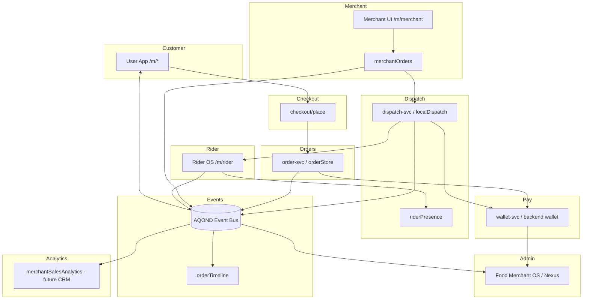

# System Data Flow

**Last Updated:** 2026-06-30  
**Purpose:** Platform map — how data moves between modules.



## Order lifecycle data flow

```
1. Customer places order
   checkout/place → order-svc (or orderStore local)
   → Event: order.created

2. Merchant fulfills
   merchantOrders.updateMerchantFulfillment
   → Events: merchant.accepted | cooking_started | ready
   → handoffOrderToDispatch (if food/on-demand)

3. Dispatch
   createDispatchJob → dispatch.search_started
   → rider offers/rejects (dispatch.* events)
   → rider accept → dispatch.rider_accepted + rider.assigned

4. Rider delivery
   phase advances → rider.picked_up → en_route → arrived
   → order.delivered

5. All consumers read same event stream
   Customer track | Admin timeline | Analytics (future)
```

## Wallet flow (simplified)

```
Payment intent → payment-svc
     → ledger audit
     → merchant wallet / rider earnings
     → settlement batch (P4)
```

## Auth flow

```
mobile/storefront → backend session / JWT
     → upstreamAuthHeaders → Go services
     → admin x-admin-key → storefront admin routes
```

## Local dev fallbacks

When `AQOND_LOCAL_DEV=1`:

- orderStore, localDispatch, aqondEventBus (JSON files)
- riderDashboard, riderPresence

**Never** use local fallbacks in production paths without feature flags.
