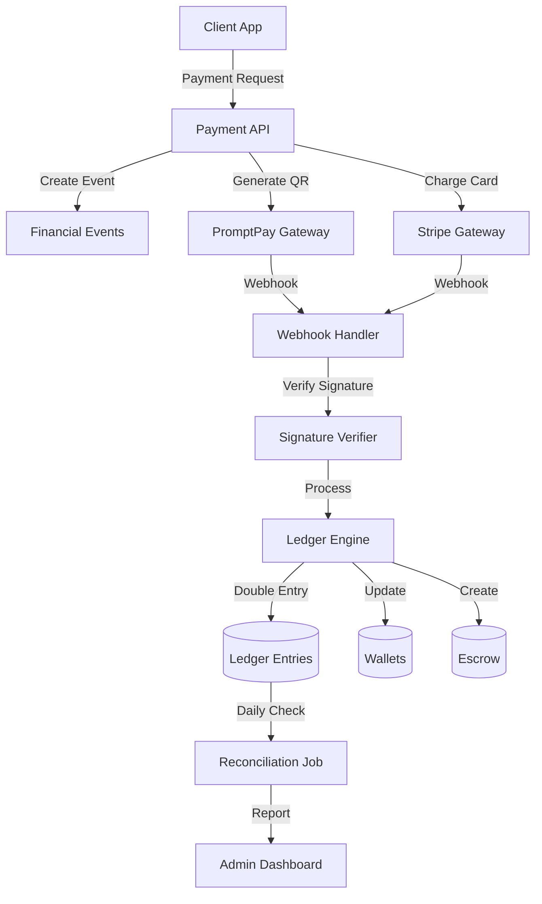
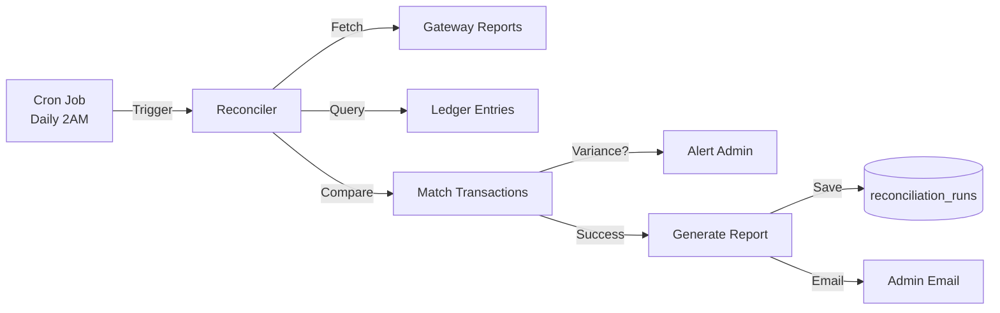

# 🟢 Phase 3: Payment Gateway & Ledger - Implementation Plan

**Target:** เงินต้องตรวจสอบย้อนหลังได้ 100% / Reconcile รายวันได้  
**Status:** 📋 PLANNING  
**Based on:** Phase 0-2 Complete (Foundation + Auth + KYC)

---

## 📊 Current State Analysis

### ✅ What We Have
- ✅ PostgreSQL with financial schema (ledger_entries, wallets, escrow_agreements)
- ✅ Redis for caching and queuing
- ✅ Express.js backend with WebSocket
- ✅ Tracing system (request_id, trace_id)
- ✅ Reference number generators (BL-, TX-, PY-)
- ✅ Audit logging system
- ✅ KYC system with daily limits
- ✅ JWT authentication with device binding

### 📦 Current Dependencies
```json
{
  "pg": "^8.17.2",           // PostgreSQL client
  "redis": "^5.10.0",         // Redis client
  "express": "^5.2.1",        // Web framework
  "jsonwebtoken": "^9.0.3",   // JWT handling
  "uuid": "^11.1.0",          // UUID generation
  "axios": "^1.13.2"          // HTTP client
}
```

### 🔍 Missing for Phase 3
- ❌ Payment gateway SDKs (Omise, Stripe)
- ❌ Webhook signature verification
- ❌ QR code generation for PromptPay
- ❌ Cron job scheduler for reconciliation
- ❌ Email notification service
- ❌ PDF receipt generation

---

## 🏗️ Architecture Design

### System Overview



---

## 💳 Payment Gateway Integration

### 1. PromptPay QR (Primary for Thai Market)

**Provider Options:**
- **Omise** (Recommended) - Thai company, good docs
- **GBPrime** - Bank-backed
- **SCB Easy** - Siam Commercial Bank

**Implementation:**
```typescript
// services/promptpay.service.ts
interface PromptPayPayment {
  payment_id: string;
  qr_code_url: string;      // QR image URL
  qr_code_data: string;      // QR code string
  amount: number;
  ref1: string;              // bill_no (BL-20260130-0001)
  ref2: string;              // transaction_no (TX-20260130-0042)
  expires_at: string;        // 15 minutes from creation
  status: 'pending' | 'paid' | 'expired' | 'cancelled';
}

class PromptPayService {
  // Generate QR code
  async generateQR(amount: number, billNo: string, txNo: string): Promise<PromptPayPayment>
  
  // Check payment status
  async checkPaymentStatus(paymentId: string): Promise<PaymentStatus>
  
  // Cancel payment
  async cancelPayment(paymentId: string): Promise<boolean>
}
```

**Required ENV Variables:**
```bash
OMISE_PUBLIC_KEY=pkey_test_xxx
OMISE_SECRET_KEY=skey_test_xxx
OMISE_WEBHOOK_SECRET=whsec_xxx
PROMPTPAY_TIMEOUT=900  # 15 minutes
```

### 2. Credit/Debit Card (Stripe)

**Implementation:**
```typescript
// services/stripe.service.ts
interface CardPayment {
  payment_intent_id: string;
  client_secret: string;     // For frontend confirmation
  amount: number;
  currency: 'thb';
  status: 'requires_payment_method' | 'succeeded' | 'failed';
  card_last4?: string;
  card_brand?: string;
}

class StripeService {
  // Create payment intent
  async createPaymentIntent(amount: number, metadata: object): Promise<CardPayment>
  
  // Confirm payment
  async confirmPayment(paymentIntentId: string): Promise<PaymentStatus>
  
  // Refund
  async refundPayment(paymentIntentId: string, amount?: number): Promise<Refund>
}
```

**Required ENV Variables:**
```bash
STRIPE_SECRET_KEY=sk_test_xxx
STRIPE_WEBHOOK_SECRET=whsec_xxx
STRIPE_PUBLISHABLE_KEY=pk_test_xxx
```

### 3. TrueMoney Wallet (Optional)

**Implementation:**
```typescript
// services/truemoney.service.ts
interface WalletPayment {
  payment_id: string;
  deep_link: string;         // truemoney://pay/xxx
  qr_code: string;           // QR for scanning
  amount: number;
  status: 'pending' | 'paid' | 'expired';
}

class TrueMoneyService {
  async createPayment(amount: number, orderId: string): Promise<WalletPayment>
  async checkStatus(paymentId: string): Promise<PaymentStatus>
}
```

---

## 📒 Immutable Ledger System

### Double-Entry Accounting Engine

**Core Principles:**
1. **Every transaction has 2+ entries** (debit and credit must balance)
2. **Immutable** - No UPDATE or DELETE allowed
3. **Sequential** - Entries are ordered by id (BIGSERIAL)
4. **Hash Chain** - Each entry references previous hash (blockchain-like)

### Ledger Entry Structure

```typescript
interface LedgerEntry {
  id: number;                    // BIGSERIAL (sequential)
  transaction_group_id: string;  // UUID linking Dr/Cr pairs
  event_id: string;              // Links to financial_events
  
  // Account (one must be set, not both)
  wallet_id?: string;            // User wallet
  system_account_id?: string;    // System account (escrow, revenue, etc.)
  
  // The Money
  direction: 'debit' | 'credit';
  amount: number;                // Always positive
  currency: 'THB';
  
  // Snapshot
  balance_after: number;         // Running balance for audit
  
  description: string;
  
  // Immutability
  created_at: string;            // Timestamp (no updated_at)
  hash: string;                  // SHA-256(id + amount + prev_hash)
  prev_hash: string;             // Previous entry hash
}
```

### Transaction Examples

#### Example 1: Job Payment (Employer → Escrow)
```typescript
const jobPayment = [
  {
    // Debit: User wallet decreases
    wallet_id: 'user_bob_wallet',
    system_account_id: null,
    direction: 'credit',  // Money OUT
    amount: 500,
    description: 'Payment for Job #123'
  },
  {
    // Credit: Escrow account increases
    wallet_id: null,
    system_account_id: 'escrow_system',
    direction: 'debit',   // Money IN
    amount: 500,
    description: 'Escrow hold for Job #123'
  }
];
```

#### Example 2: Job Completion (Escrow → Provider + Platform)
```typescript
const jobCompletion = [
  {
    // Debit: Escrow decreases (total amount)
    system_account_id: 'escrow_system',
    direction: 'credit',  // Money OUT
    amount: 500,
    description: 'Release escrow for Job #123'
  },
  {
    // Credit: Provider receives payment (minus fee)
    wallet_id: 'provider_anna_wallet',
    direction: 'debit',   // Money IN
    amount: 475,          // 500 - 25 (5% fee)
    description: 'Payment for completed Job #123'
  },
  {
    // Credit: Platform fee revenue
    system_account_id: 'revenue_platform_fee',
    direction: 'debit',   // Money IN
    amount: 25,           // 5% of 500
    description: 'Platform fee for Job #123'
  }
];
```

### Ledger Service Implementation

```typescript
// services/ledger.service.ts
class LedgerService {
  // Create transaction (atomic)
  async createTransaction(
    entries: LedgerEntryInput[],
    eventId: string,
    context: RequestContext
  ): Promise<string> {
    // 1. Validate: Total debits = Total credits
    // 2. Lock wallets (FOR UPDATE)
    // 3. Generate transaction_group_id
    // 4. Calculate hash chain
    // 5. Insert entries in transaction
    // 6. Update wallet balances
    // 7. Commit or rollback
  }
  
  // Verify ledger integrity
  async verifyIntegrity(fromId: number, toId: number): Promise<VerificationResult>
  
  // Get wallet balance from ledger (slow but accurate)
  async calculateWalletBalance(walletId: string): Promise<number>
  
  // Reconcile: Compare wallet.balance vs ledger sum
  async reconcileWallet(walletId: string): Promise<ReconciliationResult>
}
```

---

## 🔐 Webhook Verification

### Security Requirements

1. **Signature Verification** - HMAC-SHA256
2. **Timestamp Check** - Reject old webhooks (>5 minutes)
3. **Idempotency** - Handle duplicate webhooks
4. **IP Whitelist** - Only accept from gateway IPs

### Implementation

```typescript
// middleware/webhook.middleware.ts
interface WebhookPayload {
  event: string;                // 'payment.success', 'payment.failed'
  data: any;
  signature: string;            // HMAC-SHA256
  timestamp: number;            // Unix timestamp
  id: string;                   // Webhook ID (for idempotency)
}

class WebhookVerifier {
  // Verify Omise webhook
  verifyOmise(payload: string, signature: string): boolean {
    const expectedSignature = crypto
      .createHmac('sha256', process.env.OMISE_WEBHOOK_SECRET!)
      .update(payload)
      .digest('hex');
    
    return crypto.timingSafeEqual(
      Buffer.from(signature),
      Buffer.from(expectedSignature)
    );
  }
  
  // Verify Stripe webhook
  verifyStripe(payload: string, signature: string): boolean {
    // Stripe uses stripe.webhooks.constructEvent()
  }
  
  // Check timestamp freshness
  isTimestampValid(timestamp: number): boolean {
    const now = Math.floor(Date.now() / 1000);
    const diff = Math.abs(now - timestamp);
    return diff < 300;  // 5 minutes
  }
  
  // Idempotency check
  async isWebhookProcessed(webhookId: string): Promise<boolean> {
    // Check Redis: processed_webhooks:{webhookId}
  }
}
```

### Webhook Handler

```typescript
// controllers/webhook.controller.ts
export const webhookController = {
  // PromptPay webhook
  handlePromptPay: async (req: Request, res: Response) => {
    try {
      // 1. Verify signature
      const signature = req.headers['x-omise-signature'];
      if (!verifier.verifyOmise(req.body, signature)) {
        return res.status(401).json({ error: 'Invalid signature' });
      }
      
      // 2. Check idempotency
      const webhookId = req.body.id;
      if (await verifier.isWebhookProcessed(webhookId)) {
        return res.json({ status: 'already_processed' });
      }
      
      // 3. Process event
      const event = req.body.event;
      if (event === 'charge.complete') {
        await processPaymentSuccess(req.body.data);
      }
      
      // 4. Mark as processed
      await redis.setex(`processed_webhooks:${webhookId}`, 86400, 'true');
      
      res.json({ received: true });
    } catch (error) {
      logger.error('Webhook error:', error);
      res.status(500).json({ error: 'Webhook processing failed' });
    }
  }
};
```

---

## 🔄 Daily Reconciliation

### Process Flow



### Implementation

```typescript
// jobs/reconciliation.job.ts
interface ReconciliationRun {
  id: string;
  date: string;                    // YYYY-MM-DD
  provider: 'omise' | 'stripe';
  
  // Summary
  total_system_amount: number;     // From our ledger
  total_provider_amount: number;   // From gateway report
  mismatch_amount: number;         // Difference
  
  // Details
  matched_count: number;
  unmatched_system: string[];      // Transaction IDs in our system but not in gateway
  unmatched_provider: string[];    // Transaction IDs in gateway but not in our system
  
  status: 'matched' | 'mismatch_found' | 'resolved';
  report_url: string;              // CSV file in S3/Cloud Storage
  
  created_at: string;
  resolved_at?: string;
}

class ReconciliationService {
  // Run daily reconciliation
  async runDailyReconciliation(date: string): Promise<ReconciliationRun> {
    const context = createRequestContext('reconciliation_job');
    
    // 1. Get date range
    const startDate = `${date}T00:00:00Z`;
    const endDate = `${date}T23:59:59Z`;
    
    // 2. Query our ledger
    const systemTransactions = await this.getSystemTransactions(startDate, endDate);
    const systemTotal = systemTransactions.reduce((sum, tx) => sum + tx.amount, 0);
    
    // 3. Fetch gateway report (Omise)
    const omiseReport = await this.fetchOmiseReport(date);
    const providerTotal = omiseReport.reduce((sum, tx) => sum + tx.amount, 0);
    
    // 4. Match transactions
    const { matched, unmatchedSystem, unmatchedProvider } = await this.matchTransactions(
      systemTransactions,
      omiseReport
    );
    
    // 5. Calculate variance
    const variance = Math.abs(systemTotal - providerTotal);
    
    // 6. Generate report
    const report = await this.generateReport({
      date,
      systemTotal,
      providerTotal,
      variance,
      matched,
      unmatchedSystem,
      unmatchedProvider
    });
    
    // 7. Alert if mismatch
    if (variance > 0) {
      await this.alertAdmin(report);
    }
    
    // 8. Save to database
    return await this.saveReconciliationRun(report);
  }
  
  // Fetch Omise settlement report
  async fetchOmiseReport(date: string): Promise<OmiseTransaction[]> {
    // Call Omise API: GET /settlements
  }
  
  // Match transactions by reference numbers
  async matchTransactions(
    systemTxs: LedgerEntry[],
    providerTxs: OmiseTransaction[]
  ): Promise<MatchResult> {
    // Match by ref1 (bill_no) and ref2 (transaction_no)
  }
}
```

### Cron Job Setup

```typescript
// jobs/scheduler.ts
import cron from 'node-cron';

// Run daily at 2:00 AM Bangkok time
cron.schedule('0 2 * * *', async () => {
  const yesterday = new Date();
  yesterday.setDate(yesterday.getDate() - 1);
  const date = yesterday.toISOString().split('T')[0];
  
  logger.info(`Starting reconciliation for ${date}`);
  
  try {
    const result = await ReconciliationService.runDailyReconciliation(date);
    logger.info(`Reconciliation completed: ${result.status}`);
  } catch (error) {
    logger.error('Reconciliation failed:', error);
  }
}, {
  timezone: 'Asia/Bangkok'
});
```

---

## 🗄️ Database Migrations

### Migration Plan

```sql
-- migrations/003_phase3_payment_system.sql

-- 1. Create payment_gateways table
CREATE TABLE payment_gateways (
  id UUID PRIMARY KEY DEFAULT uuid_generate_v4(),
  provider VARCHAR(50) NOT NULL,  -- 'omise', 'stripe', 'truemoney'
  api_key_encrypted TEXT NOT NULL,
  webhook_secret_encrypted TEXT NOT NULL,
  is_active BOOLEAN DEFAULT TRUE,
  is_test_mode BOOLEAN DEFAULT TRUE,
  config JSONB DEFAULT '{}',
  created_at TIMESTAMP WITH TIME ZONE DEFAULT CURRENT_TIMESTAMP,
  updated_at TIMESTAMP WITH TIME ZONE DEFAULT CURRENT_TIMESTAMP
);

-- 2. Update financial_events table
ALTER TABLE financial_events ADD COLUMN IF NOT EXISTS gateway_provider VARCHAR(50);
ALTER TABLE financial_events ADD COLUMN IF NOT EXISTS gateway_transaction_id VARCHAR(255);
ALTER TABLE financial_events ADD COLUMN IF NOT EXISTS gateway_response JSONB;

-- 3. Create webhook_events table (for idempotency)
CREATE TABLE webhook_events (
  id UUID PRIMARY KEY DEFAULT uuid_generate_v4(),
  webhook_id VARCHAR(255) UNIQUE NOT NULL,
  provider VARCHAR(50) NOT NULL,
  event_type VARCHAR(100) NOT NULL,
  payload JSONB NOT NULL,
  signature VARCHAR(255),
  processed BOOLEAN DEFAULT FALSE,
  processed_at TIMESTAMP WITH TIME ZONE,
  created_at TIMESTAMP WITH TIME ZONE DEFAULT CURRENT_TIMESTAMP
);

CREATE INDEX idx_webhook_events_processed ON webhook_events(processed, created_at);
CREATE INDEX idx_webhook_events_provider ON webhook_events(provider, event_type);

-- 4. Add hash chain to ledger_entries
ALTER TABLE ledger_entries ADD COLUMN IF NOT EXISTS hash VARCHAR(64);
ALTER TABLE ledger_entries ADD COLUMN IF NOT EXISTS prev_hash VARCHAR(64);

-- Function to calculate hash
CREATE OR REPLACE FUNCTION calculate_ledger_hash(
  entry_id BIGINT,
  amount NUMERIC,
  prev_hash_val VARCHAR
) RETURNS VARCHAR AS $$
BEGIN
  RETURN encode(
    digest(
      entry_id::TEXT || amount::TEXT || COALESCE(prev_hash_val, ''),
      'sha256'
    ),
    'hex'
  );
END;
$$ LANGUAGE plpgsql;

-- Trigger to auto-calculate hash on insert
CREATE OR REPLACE FUNCTION set_ledger_hash()
RETURNS TRIGGER AS $$
DECLARE
  last_hash VARCHAR(64);
BEGIN
  -- Get previous entry hash
  SELECT hash INTO last_hash
  FROM ledger_entries
  WHERE id < NEW.id
  ORDER BY id DESC
  LIMIT 1;
  
  -- Calculate current hash
  NEW.prev_hash := COALESCE(last_hash, '');
  NEW.hash := calculate_ledger_hash(NEW.id, NEW.amount, NEW.prev_hash);
  
  RETURN NEW;
END;
$$ LANGUAGE plpgsql;

CREATE TRIGGER trg_set_ledger_hash
BEFORE INSERT ON ledger_entries
FOR EACH ROW EXECUTE FUNCTION set_ledger_hash();

-- 5. Create reconciliation_runs table
CREATE TABLE reconciliation_runs (
  id UUID PRIMARY KEY DEFAULT uuid_generate_v4(),
  date DATE NOT NULL,
  provider VARCHAR(50) NOT NULL,
  
  status VARCHAR(20) DEFAULT 'pending' CHECK (
    status IN ('pending', 'matched', 'mismatch_found', 'resolved')
  ),
  
  total_system_amount NUMERIC(18,2) DEFAULT 0,
  total_provider_amount NUMERIC(18,2) DEFAULT 0,
  mismatch_amount NUMERIC(18,2) DEFAULT 0,
  
  matched_count INTEGER DEFAULT 0,
  unmatched_system_count INTEGER DEFAULT 0,
  unmatched_provider_count INTEGER DEFAULT 0,
  
  report_data JSONB,
  report_url TEXT,
  notes TEXT,
  
  created_at TIMESTAMP WITH TIME ZONE DEFAULT CURRENT_TIMESTAMP,
  resolved_at TIMESTAMP WITH TIME ZONE,
  resolved_by UUID REFERENCES users(id),
  
  UNIQUE(date, provider)
);

CREATE INDEX idx_reconciliation_date ON reconciliation_runs(date DESC);
CREATE INDEX idx_reconciliation_status ON reconciliation_runs(status);
```

---

## 📦 Required Dependencies

```bash
# Install payment gateway SDKs
npm install omise stripe

# Install QR code generation
npm install qrcode

# Install cron job scheduler
npm install node-cron @types/node-cron

# Install PDF generation (for receipts)
npm install pdfkit @types/pdfkit

# Install email service
npm install nodemailer @types/nodemailer

# Install crypto utilities (already have Node.js crypto)
# npm install crypto-js  # Optional alternative
```

---

## 🎯 Implementation Roadmap

### Week 1: Foundation & Infrastructure

**Day 1-2: Database Setup**
- [ ] Run Phase 3 migrations
- [ ] Test ledger hash chain
- [ ] Seed system_accounts table
- [ ] Test wallet balance reconciliation

**Day 3-4: Payment Gateway Integration (PromptPay)**
- [ ] Setup Omise account (test mode)
- [ ] Implement PromptPayService
- [ ] Generate QR codes
- [ ] Test payment flow (sandbox)

**Day 5: Stripe Integration**
- [ ] Setup Stripe account (test mode)
- [ ] Implement StripeService
- [ ] Test card payments (test cards)

### Week 2: Ledger System

**Day 6-7: Ledger Engine**
- [ ] Implement LedgerService
- [ ] Double-entry validation
- [ ] Hash chain calculation
- [ ] Transaction atomicity

**Day 8-9: Financial Events**
- [ ] Create financial_events handlers
- [ ] Link events to ledger entries
- [ ] Implement idempotency keys

**Day 10: Testing & Edge Cases**
- [ ] Test concurrent transactions
- [ ] Test rollback scenarios
- [ ] Test balance calculations

### Week 3: Webhooks & Integration

**Day 11-12: Webhook Handlers**
- [ ] Implement webhook verification
- [ ] Create webhook controllers
- [ ] Test signature validation
- [ ] Implement idempotency

**Day 13-14: Payment Flow Integration**
- [ ] Connect payment → event → ledger
- [ ] Test end-to-end job payment
- [ ] Test escrow release
- [ ] Test refunds

**Day 15: Error Handling**
- [ ] Implement retry logic
- [ ] Handle failed payments
- [ ] Alert system for errors

### Week 4: Reconciliation & Monitoring

**Day 16-17: Reconciliation Service**
- [ ] Implement ReconciliationService
- [ ] Fetch gateway reports
- [ ] Match transactions
- [ ] Generate reports

**Day 18: Cron Jobs**
- [ ] Setup scheduler
- [ ] Configure daily reconciliation
- [ ] Test report generation

**Day 19-20: Admin Dashboard**
- [ ] Financial overview page
- [ ] Reconciliation reports view
- [ ] Variance alerts
- [ ] Manual reconciliation tools

---

## ✅ Acceptance Criteria

### Phase 3 Complete When:

- [ ] ✅ **Payment Gateway Works**
  - PromptPay QR payment successful
  - Stripe card payment successful
  - Webhook verification working
  - Payment status tracking accurate

- [ ] ✅ **Ledger System Operational**
  - All transactions recorded in ledger
  - Double-entry validation enforced
  - Hash chain integrity maintained
  - No direct wallet balance updates

- [ ] ✅ **Reconciliation Functional**
  - Daily reconciliation runs automatically
  - Reports generated correctly
  - Variance detection working
  - Admin alerts sent for mismatches

- [ ] ✅ **Traceability 100%**
  - Any transaction traceable by ID
  - Complete audit trail
  - Reference numbers working
  - Forensic debugging possible

- [ ] ✅ **Security Hardened**
  - Webhook signatures verified
  - Idempotency enforced
  - No duplicate payments
  - PCI-DSS compliance (for cards)

---

## 🧪 Testing Strategy

### Unit Tests
```typescript
// ledger.service.test.ts
describe('LedgerService', () => {
  test('should validate double-entry balance', async () => {
    const entries = [
      { direction: 'debit', amount: 100 },
      { direction: 'credit', amount: 100 }
    ];
    
    const isValid = await ledger.validateBalance(entries);
    expect(isValid).toBe(true);
  });
  
  test('should calculate hash chain correctly', async () => {
    const entry = await ledger.createEntry({...});
    expect(entry.hash).toMatch(/^[a-f0-9]{64}$/);
  });
});
```

### Integration Tests
```typescript
// payment-flow.test.ts
describe('Payment Flow', () => {
  test('complete job payment flow', async () => {
    // 1. Create payment
    const payment = await paymentService.create(jobId, 500);
    
    // 2. Simulate webhook
    await webhookHandler.handlePaymentSuccess(payment.id);
    
    // 3. Verify ledger entries
    const entries = await ledger.getByTransactionGroup(payment.txGroupId);
    expect(entries).toHaveLength(2); // Dr + Cr
    
    // 4. Verify wallet balance
    const wallet = await walletService.getBalance(userId);
    expect(wallet.balance).toBe(originalBalance - 500);
  });
});
```

---

## 📝 Configuration Files

### Environment Variables (.env.production)
```bash
# Payment Gateways
OMISE_PUBLIC_KEY=pkey_live_xxx
OMISE_SECRET_KEY=skey_live_xxx
OMISE_WEBHOOK_SECRET=whsec_xxx

STRIPE_SECRET_KEY=sk_live_xxx
STRIPE_WEBHOOK_SECRET=whsec_xxx
STRIPE_PUBLISHABLE_KEY=pk_live_xxx

# Reconciliation
RECONCILIATION_CRON="0 2 * * *"  # 2 AM daily
RECONCILIATION_ALERT_EMAIL=finance@meerak.app

# Ledger
LEDGER_VERIFICATION_INTERVAL=3600  # 1 hour
HASH_ALGORITHM=sha256

# Limits
MAX_PAYMENT_AMOUNT=500000  # ฿500,000
MIN_PAYMENT_AMOUNT=10      # ฿10
PAYMENT_TIMEOUT=900        # 15 minutes
```

---

## 🔒 Security Considerations

1. **API Key Storage**
   - Never commit keys to Git
   - Use encrypted storage (AWS Secrets Manager / Vault)
   - Rotate keys quarterly

2. **Webhook Security**
   - Always verify signatures
   - Use HTTPS only
   - Check timestamp freshness
   - Implement rate limiting

3. **Database Security**
   - No direct ledger updates
   - Use stored procedures for sensitive ops
   - Encrypt sensitive fields
   - Regular backups

4. **Monitoring**
   - Log all payment attempts
   - Alert on suspicious patterns
   - Monitor reconciliation failures
   - Track API errors

---

## 📊 Monitoring & Alerts

### Key Metrics to Track

1. **Payment Success Rate**
   - Target: > 95%
   - Alert if: < 90% (15 min window)

2. **Reconciliation Variance**
   - Target: ฿0 variance
   - Alert if: > ฿100 variance

3. **Ledger Integrity**
   - Run hash verification hourly
   - Alert on any hash mismatch

4. **Webhook Processing Time**
   - Target: < 2 seconds
   - Alert if: > 5 seconds (p95)

### Alert Channels
- Email: finance@meerak.app
- Slack: #payment-alerts
- SMS: For critical issues (variance > ฿10,000)

---

## 🚀 Deployment Checklist

### Pre-Production
- [ ] Test mode verified on staging
- [ ] All unit tests passing
- [ ] Integration tests passing
- [ ] Load testing completed (100 concurrent payments)
- [ ] Reconciliation tested with mock data

### Production Cutover
- [ ] Database migrations applied
- [ ] API keys configured (production)
- [ ] Webhook URLs registered with gateways
- [ ] Cron jobs scheduled
- [ ] Monitoring enabled
- [ ] Alert rules configured
- [ ] Rollback plan documented

### Post-Deployment
- [ ] Monitor first 24 hours closely
- [ ] Verify first reconciliation run
- [ ] Check ledger integrity
- [ ] Review error logs
- [ ] Validate payment flows

---

## 📚 Documentation to Create

1. **API Documentation**
   - Payment API endpoints
   - Webhook payload formats
   - Error codes and responses

2. **Admin Guide**
   - How to review reconciliation reports
   - How to handle variances
   - Manual reconciliation procedures

3. **Developer Guide**
   - Ledger system architecture
   - How to add new payment methods
   - Testing payment flows

4. **Runbook**
   - Payment failure troubleshooting
   - Reconciliation failure resolution
   - Emergency procedures

---

## 🎓 Next Phase Preview

**Phase 4: Admin Dashboard**
- User management
- KYC review queue
- Financial dashboard (using Phase 3 data)
- Manual payment operations
- Audit log viewer

---

**Plan Status:** ✅ READY FOR REVIEW  
**Estimated Duration:** 4 weeks (20 working days)  
**Team Required:** 2-3 developers + 1 QA  
**Risk Level:** Medium-High (financial system)

**Last Updated:** 2026-01-30  
**Version:** 1.0
